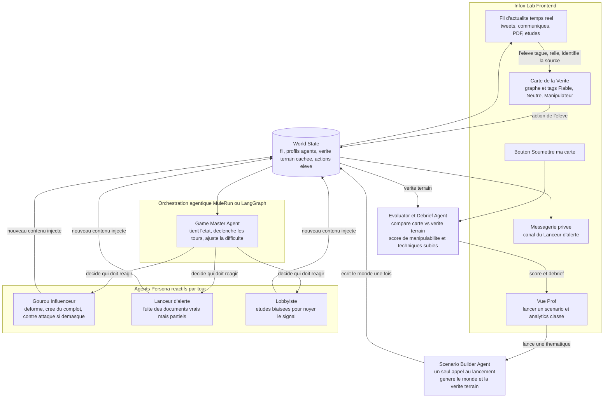
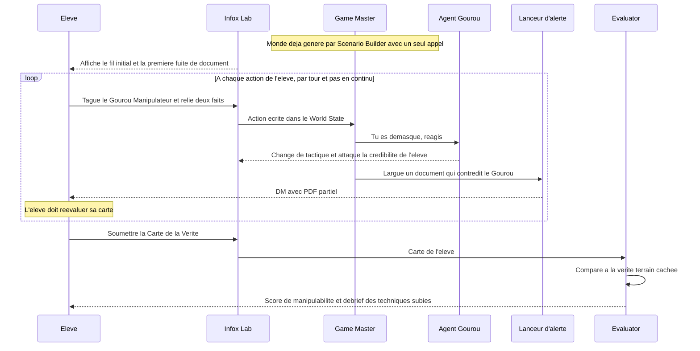

# Chronos.io, L'Infox Lab

## Concept

Chronos.io est une simulation pedagogique de desinformation pour l'education aux medias et a l'information. Des agents injectent des contenus vrais, faux ou ambigus dans un fil d'actualite. L'eleve doit enqueter sur une Carte de la Verite, qualifier les noeuds avec Fiable, Neutre ou Manipulateur, relier les informations a leurs sources, puis soumettre son analyse.

## Probleme traite

Face aux deepfakes, aux faux experts et aux campagnes d'influence, l'enjeu pedagogique n'est plus seulement de trouver une information, mais de savoir evaluer sa fiabilite, sa source et son intention.

## Solution

L'Infox Lab propose un parcours court et demonstrable :

1. Charger un scenario statique pregenere.
2. Afficher un fil d'actualite et un board d'enquete.
3. Laisser l'eleve taguer et relier les elements.
4. Faire reagir les agents par tour apres une action.
5. Evaluer deterministiquement la Carte de la Verite.
6. Afficher un score et un debrief pedagogique.

## Architecture

Le scenario est genere une seule fois puis servi sous forme de `scenario.json`. Le frontend ne genere pas de scenario et n'appelle pas de LLM. Les reactions agentiques passent par `/action`. L'evaluation finale passe par `/submit`.

## Contrat de donnees

Le frontend affiche uniquement `id`, `type`, `label`, `contenu` et `feed_initial`. Les champs `verdict_reel`, `source_reelle`, `liens_corrects` et `technique` restent caches et reserves au backend ou au fallback local d'evaluation.

Verdicts eleve autorises :

- `fiable`
- `neutre`
- `manipulateur`

Acteurs attendus :

- `a1` : Agent Gourou
- `a2` : Agent Lobbyiste
- `a3` : Lanceur d'alerte

## Routes API

`GET /scenario`

Charge le scenario principal depuis le backend.

`POST /action`

Recoit une action eleve et l'etat courant :

```json
{
  "scenario_id": "energie-2026",
  "action": { "type": "tag", "id": "i1", "verdict": "manipulateur" },
  "state": {
    "verdicts": [{ "id": "i1", "verdict": "manipulateur" }],
    "liens": [{ "from": "i1", "to": "a1" }]
  }
}
```

`POST /submit`

Recoit la Carte de la Verite finale :

```json
{
  "scenario_id": "energie-2026",
  "verdicts": [{ "id": "i1", "verdict": "manipulateur" }],
  "liens": [{ "from": "i1", "to": "a1" }]
}
```

## Installation

```bash
cd CDG-Hackaton/chronos-io
npm install
```

## Lancement

API live Partie D :

```bash
cd CDG-Hackaton
npm start
```

L'API ecoute par defaut sur `http://localhost:8787`.

Frontend avec proxy vers la Partie D :

```bash
cd CDG-Hackaton/chronos-io
npm run dev
```

Build de verification :

```bash
cd CDG-Hackaton/chronos-io
npm run build
```

## Parcours de demo

1. Ouvrir `http://localhost:5173`.
2. Cliquer sur `LANCER UN SCENARIO`.
3. Verifier que le fil initial et les trois acteurs apparaissent.
4. Cliquer une information dans le fil ou sur le board.
5. Poser un verdict `Manipulateur`.
6. Passer en mode `Relier` ou utiliser le panneau droit pour relier l'information a `Agent Gourou`.
7. Observer la riposte du Gourou dans le fil si le backend repond, ou le fallback local si `/action` est indisponible.
8. Cliquer sur `SOUMETTRE LA CARTE`.
9. Lire le score, le label et le debrief.

## Choix techniques

- React et Vite pour aller vite sans serveur frontend complexe.
- React Flow pour le board draggable et les liens.
- Service API centralise dans `src/services/api.js`.
- Fallback local deterministe pour la demo.
- Aucun appel LLM cote frontend.

## Garde fous

- Le scenario est genere une seule fois.
- `scenario.json` peut etre servi statiquement.
- Les agents reagissent uniquement par tour apres action eleve.
- L'evaluation finale est deterministe.
- Le frontend ne revele jamais la verite terrain.
- La consommation de tokens est minimisee.
- Le projet cible l'EMI, l'esprit critique, l'enseignement superieur et la formation professionnelle.

## Diagrammes Mermaid




